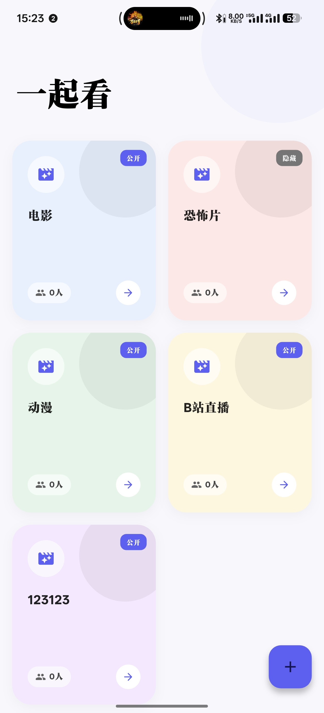
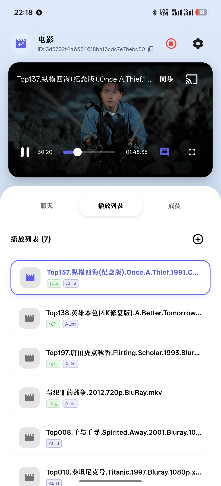

# SyncTV 的一个前端项目，支持全平台。
<p align="center">
  <a href="https://github.com/synctv-org/SyncTV_APP/releases/latest">
    
  </a>
  <a href="https://opensource.org/licenses/Apache-2.0">
    
  </a>
  <a href="https://github.com/synctv-org/SyncTV_APP/stargazers">
    
  </a>
  <a href="https://github.com/synctv-org/SyncTV_APP/releases/latest">
    
  </a>

</p>

SyncTV 是一款跨平台的视频同步观看应用，允许用户创建或加入房间，与好友实时同步观看视频，并支持即时聊天、弹幕互动以及语音通话功能。

## Server 端项目介绍
**Server端作者**：[zijiren233](https://github.com/zijiren233)  |   **APP端作者**：[TOM88812](https://github.com/TOM88812) 

**项目地址**：[SyncTV_SERVER](https://github.com/synctv-org/synctv)

**支持的平台** ：Android、IOS、Windows、MacOS、Linux、Android TV、Android Pad
## 📸 预览

| 首页 | 播放界面 |
|:---:|:---:|
|  |  |

## ✨ 主要功能

### 1. 房间系统
*   **创建/加入房间**：支持创建公开或加密房间。
*   **房间管理**：房主可管理房间设置（修改密码、踢出成员等）。
*   **多端同步**：无论是在 PC 还是移动端，都能获得一致的房间列表体验。

### 2. 视频同步播放
*   **多格式支持**：基于 `media_kit` 内核，支持 MP4, MKV, AVI, FLV, M3U8 等几乎所有主流音视频格式。
*   **精准同步**：毫秒级的播放进度同步，支持暂停、播放、倍速调节同步。
*   **画质调节**：支持多分辨率切换（需视频源支持）。

### 3. 社交互动
*   **实时聊天**：房间内内置 WebSocket 实时聊天室。
*   **弹幕系统**：支持视频弹幕显示，互动更有趣。
*   **语音通话**：基于 WebRTC 的实时语音交流功能，无需打字即可畅聊。

### 4. 资源管理
*   **电影/视频库**：支持添加和管理房间内的视频资源。
*   **目录浏览**：支持层级目录结构的视频资源浏览。
*   **链接解析**：支持直接添加网络视频链接（如 HLS/M3U8）。
*   **Typed Provider 来源**：解析、预览和目录条目直接携带服务端 protobuf source config，支持选择部分媒体或创建动态播放列表。

### 5. 媒体 Provider

| 类型 | Provider 与能力 |
|:---|:---|
| 视频与直播平台 | Bilibili、Twitch、YouTube、抖音、TikTok、虎牙、斗鱼、AcFun、CCTV；支持 URL/ID 解析、原生清晰度、封面，以及平台可用的字幕、弹幕、聊天、章节或 Storyboard |
| 媒体服务器与文件服务 | Emby/Jellyfin、Alist、Cloudreve；支持账号绑定、目录/搜索、缩略图、字幕、转码和动态来源 |
| NAS 与私有云 | FNOS、QNAP、Synology、Nextcloud、Seafile、TrueNAS；支持文件浏览、搜索、Preview/thumbnail，以及设备提供的媒体库、转码、收藏和播放进度能力 |
| 通用来源 | Direct URL、RTMP、Live Proxy；支持自定义 header、Range、HLS/FLV 和房间直播 |

App 会根据 Provider instance 的绑定能力控制账号来源。例如 Twitch Followed Live 需要 `user:read:follows` scope；YouTube 订阅、喜欢和稍后观看需要 Cookie。`使用房主凭据` 由用户在创建来源时选择。

### 6. 个性化体验
*   **深色模式**：自动适配系统深色/浅色模式，或强制纯白主题。
*   **自定义配置**：支持长按标题修改服务器地址，方便私有化部署连接。

## 🛠️ 技术栈

*   **框架**: Flutter (Dart)

## 🚀 快速开始

### 1. 环境要求
*   Flutter SDK >= 3.44.7
*   Dart SDK >= 3.12.2
*   `protoc` 与 Dart `protoc_plugin`

### 2. 获取代码
```bash
git clone https://github.com/synctv-org/synctv-app.git
cd synctv-app
```

### 3. 更新 protobuf 生成代码
服务端 API 以本仓库 `proto/` 目录中的 protobuf 为准。同步服务端协议后，先把 proto 文件复制到本项目 `proto/`，再重新生成 Dart 代码：

```bash
dart pub global activate protoc_plugin
bash tool/generate_proto.sh
```

生成脚本只读取当前项目的 `proto/`，不会引用服务端仓库路径。

### 4. 运行与验证

```bash
flutter pub get
dart analyze
flutter test
flutter run
```

运行 App 前先启动 SyncTV 后端。首页长按 `SyncTV` 标题可以切换服务器根地址。

开发构建默认连接 `http://127.0.0.1:8080`。Release 构建默认要求用户首次启动时添加服务器，也可以在构建时内置一个服务器：

```bash
flutter build apk --release \
  --dart-define SYNCTV_BUILT_IN_SERVER_URL=https://tv.example.com
```

Release workflow 会读取同名 GitHub repository variable。未配置 `SYNCTV_BUILT_IN_SERVER_URL` 的仓库会生成通用安装包，并在首次启动时进入服务器配置流程。

## Provider 使用

1. 在账号中心打开平台绑定。
2. 选择 Provider 和 Provider instance，完成账号、Cookie、token、API key 或 NAS 登录。
3. 进入房间媒体库并打开添加媒体。
4. 输入 URL/ID，或使用热门、分类、收藏、历史、搜索和目录浏览入口。
5. 预览服务端返回的资源，选择单个/部分条目，或创建完整动态播放列表。
6. 播放页根据 Provider 返回的 mode 选择清晰度、直连或 proxy。

Bilibili 支持多 P、热门、推荐、UP、收藏、合集、系列、稍后观看、历史、追番、番剧时间表/索引和直播来源。Twitch 支持直播、VOD、Clip、频道归档、关注/分类/搜索直播和排期。YouTube 支持视频、播放列表、频道 Videos/Shorts/Live、搜索、热门与账号 feed。

完整说明见后端文档站的 [Provider 使用手册](https://github.com/synctv-org/synctv/blob/main/docs/src/content/docs/use/provider-guide.mdx)。

## 开发结构

| 目录 | 职责 |
|:---|:---|
| `proto/` | 当前 SyncTV 公开 protobuf 源文件 |
| `lib/src/generated/proto/` | `tool/generate_proto.sh` 生成的 Dart protobuf |
| `lib/models/` | Provider domain model、typed source-config helper 和 codec |
| `lib/services/synctv_api_facades.dart` | protobuf HTTP facade |
| `lib/services/synctv_provider_service.dart` | Provider protobuf 到 App domain 的映射 |
| `lib/services/synctv_service.dart` | UI 使用的稳定 service 入口 |
| `lib/widgets/platform_binding_dialog.dart` | Provider 绑定、能力显示和解绑 |
| `lib/widgets/add_media/` | 每个 Provider 独立的解析、预览、选择和创建流程 |
| `test/models/`、`test/services/`、`test/widgets/` | codec、service 与 Widget 回归测试 |

新增 Provider UI 时按以下顺序接入：

1. 同步服务端 `synctv-proto/proto` 到 App `proto/` 并生成代码。
2. 为该 Provider 创建独立 source-config helper 和 domain model。
3. 在 `SourceConfigCodec` 增加 protobuf/map 双向 round trip。
4. 接入 API facade、Provider domain service 和 `SyncTvService`。
5. 在平台绑定页实现凭据和 capability 流程。
6. 在 `widgets/add_media/` 创建独立表单与预览组件。
7. 添加 codec、service、Widget 和 UI guard 测试。

Provider 的 DTO、分页和产品状态保持独立。App 使用服务端返回的 typed source config，并把 shared scope 作为创建时的用户选择。完整跨层流程见 [Provider 开发指南](https://github.com/synctv-org/synctv/blob/main/docs/src/content/docs/develop/provider-development.mdx)。

## ⚙️ 隐藏功能
*   **修改服务器地址**：在首页长按顶部 "SyncTV" 标题，即可弹出服务器配置对话框，支持连接到私有部署的 SyncTV 后端。

*   **注意**填写服务端根地址即可，例如 `https://tv.example.com`。客户端会根据 protobuf API 自动拼接当前服务端路径；已保存的旧 `/api` 后缀会被自动规范化。

## 📄 开源协议
Apache-2.0 license

# 免责声明

- 这个程序是一个免费且开源的项目。它旨在播放网络上的视频文件，方便多人同步观看视频和学习。
- 在使用时，请遵守相关法律法规，不要滥用。
- 该程序仅进行客户端播放视频文件/流量转发，不会拦截、存储或篡改任何用户数据。
- 在使用该程序之前，您应该了解并承担相应的风险，包括但不限于版权纠纷、法律限制等，这与该程序无关。
# 讨论

- [Telegram](https://t.me/synctv)
